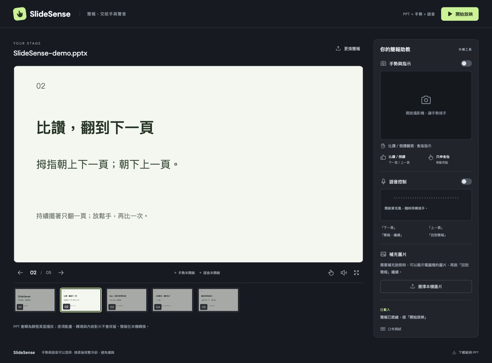

# SlideSense

上傳 PowerPoint，用手勢與中文語音交替控制簡報，食指就是畫面上的指示亮點。



目前版本：比讚下一頁、倒讚上一頁、食指指示；語音直接說「下一頁／上一頁」。上圖使用內建範例，攝影機與麥克風尚未開啟。

## 功能

- 上傳 `.pptx`、`.ppt` 或 `.pdf`，在瀏覽器播放與全螢幕展示。
- 比讚：下一頁；倒讚：上一頁。穩定約 0.18 秒觸發，持續擺著只翻一頁。
- 只伸出食指：移動指示亮點；中央 40% 鏡頭範圍對應整張投影片，收手自動隱藏。
- 張開手掌停住不會觸發動作；可用按鈕或語音暫停手勢。
- 中文語音與手勢同時開啟，共用 1.1 秒換頁冷卻，避免連跳。
- 展示本機圖片，關閉後回到目前投影片。
- 鍵盤、按鈕、縮圖與手動滑鼠指示模式。

此版本已依需求移除 AI 生圖，**不需要 API 金鑰**。

## 啟動

需要 Node.js 22+、Chrome、攝影機／麥克風，以及 LibreOffice 轉換工具。

```bash
npm ci
npm run dev
```

開啟 <http://127.0.0.1:4317>。第一次安裝會從 Google 的官方模型儲存空間下載 MediaPipe 手部模型，並把 WASM 複製到本機。若下載被中斷，重新執行 `npm run setup`。

簡報轉換使用 `SOFFICE_PATH` 指定的執行檔。若本機有 Codex bundled headless LibreOffice，程式會自動使用；其他環境會使用 PATH 中的 `soffice`。

```bash
# 一般 macOS LibreOffice 安裝的範例
SOFFICE_PATH="/Applications/LibreOffice.app/Contents/MacOS/soffice" npm run dev
```

沒有 LibreOffice 時，仍可上傳 PDF。Linux 使用者可安裝 `libreoffice-impress` 與中文字型（例如 `fonts-noto-cjk`）。請安裝簡報使用的字型，降低換行和版面差異。

正式建置：

```bash
npm run build
npm start
```

## 操作

1. 上傳自己的 PPT，或按「先試試五頁範例」。
2. 開啟攝影機與語音，允許瀏覽器存取裝置。
3. 讓一隻手完整出現在鏡頭內。只伸食指進入指示模式；比讚或倒讚才會切頁。再次做同一手勢前，先放鬆手或收手約 0.22 秒。
4. 直接說「下一頁」。
5. 按「開始放映」。`Esc` 離開全螢幕，方向鍵前後切頁。

| 口令 | 動作 |
| --- | --- |
| 下一頁 | 下一頁 |
| 上一頁 | 上一頁 |
| 簡報，暫停 | 暫停手勢；語音保持可用 |
| 簡報，繼續 | 恢復手勢 |
| 回到簡報 | 收起本機補充圖片 |

「簡報，下一頁」「簡報，上一頁」仍相容。

控制區的「口令測試」直接測試文字解析與指令路由，不是麥克風辨識證明。「滑鼠指示模式」是手動備援，不是攝影機辨識。

## 已知限制

- PPT 轉為 PDF 靜態頁面。逐項動畫、轉場、內嵌影音與原生簡報講者備註不會播放。
- 最多 60 MB、200 頁；有密碼的檔案須先解除保護。
- 語音使用瀏覽器的 Web Speech API，可能連線至瀏覽器供應商的語音服務；不承諾離線語音。
- 手部辨識在瀏覽器本機執行。光線、鏡頭距離與手部遮擋會影響辨識，正式報告前請先試用。
- 翻頁時收起其餘四指，拇指朝畫面上方為下一頁、朝下方為上一頁；左右手皆可。張掌或左右揮不會切頁。
- 此原型綁定 `127.0.0.1`，設計為個人本機工具，不是可直接對外公開的多人上傳服務。

## 資料處理

上傳的簡報只放在本機作業系統的暫存目錄；正常關閉伺服器會清理該次工作階段。若程式被強制終止，可能留下 `slidesense-*` 暫存資料夾。檔案不會提交至 GitHub，也不會傳給生圖服務。模型和字型在安裝後從本機提供。

## 驗證與 demo

```bash
npm test
npm run build
# 伺服器啟動後，測試實際 PPTX 上傳與安全邊界
npm run verify:upload
```

- 邏輯測試涵蓋：語音誤觸、手嘴重複換頁、翻頁邊界、食指／拇指互斥、比讚／倒讚、暫停與手部消失。
- 五頁 [範例 PPTX](public/demo/SlideSense-demo.pptx) 可用於實際上傳測試。
- [介面 demo 影片](docs/SlideSense-demo.mp4)：早期介面錄影，標明文字口令及滑鼠操作；片中揮手提示已改為比讚／倒讚。
- [90 秒錄影腳本](docs/DEMO.md) 說明真人手勢與語音 demo 的操作順序。
- [驗證紀錄](docs/VALIDATION.md) 區分自動／瀏覽器驗證與待真人確認的項目。

## 技術

React、TypeScript、Vite、Express、LibreOffice、PDF.js、MediaPipe Hand Landmarker、Web Speech API。手勢與語音都進入同一個換頁閘門；指尖座標以鏡像、畫面範圍映射與平滑處理更新亮點。

第三方授權見 [THIRD_PARTY_NOTICES.md](THIRD_PARTY_NOTICES.md)。
